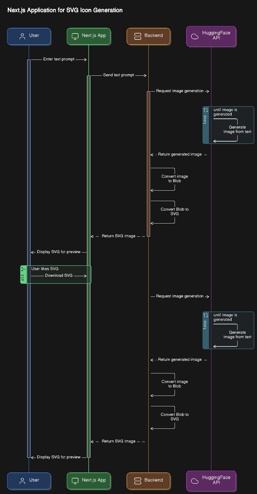

# SVGPix

## FreeAI Textin, SVGout 

Unleash the AI magic! Turn your text into dazzling SVG art for free. No sweat, just pure tech wizardry!Sprinkle AI magic on visuals! Instantly snag unique SVG flair - quick, chic and effortlessly cool.

# Disclaimer

Since i am using the Free version of HuggingFaceInference model it might take some time to generate the result.

# About

Downloading SVG images from third party services might be an easy way but wait what if you don't see the icons that you wish to have in your project or in your poster image.

Well your are not alone in this situation even i too had a similar experience where i can't find the SVG icons/images which i need. So what will we do. We are in the age of AI where we can leverage the power of AI for the things that we want.

# Architecture




# Tech Stack

Tech Stack used to build this application is 

* Next.js with TailwindCSS and Shadcn UI
* HuggingFace Inference API (Free version) TextToImage Model
* Model (dataautogpt3/OpenDalleV1.1)

## Installation

Ensure you are having Nodejs. Clone the project in your local machine and follow the below instructions.

```bash
  cd svgimagegenerator
  npm install
```

Create a new .env.local file and add your HuggingFace API like below example

```bash
  HUGGINGFACE_API_KEY=hf_FpwDTyRrHXQOkZhtrhkIHTdrvoDG
```

Once you done the above 2 steps its time to run the application locally

```bash
npm run dev
```
## Demo

Insert gif or link to demo

